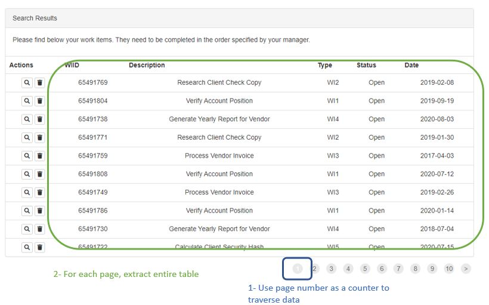

# YearlyReportDispatcher
UiPath REF project - Dispatcher for the yearly report process

The RE framework project dispathes queue items for the **Generate Yearly Report** project to perform.
To see how the performer works on the generated queue items, visit the project [Generate Yearly Report](https://github.com/ugokcesu/GenerateYearlyReport)

# Process
1. Navigate to each page of https://acme-test.uipath.com/work-items
2. Extract entire table in each page
3. Filter to only ```Type = WI4 and Status = Open```
4. Add filtered items to orchestrator queue

